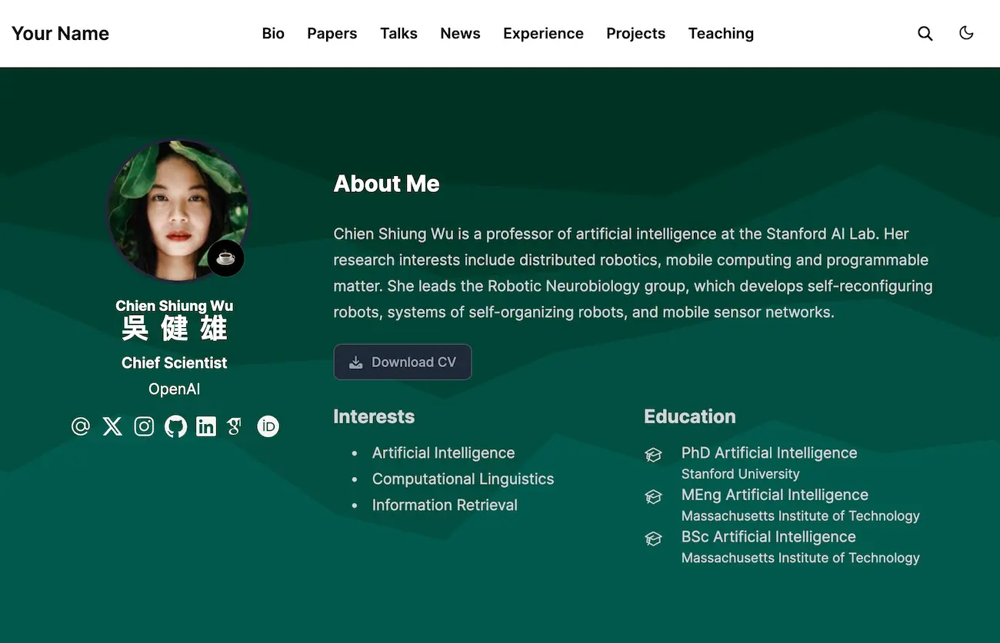

# Hi there,

# Hengameh Shahrooei

📍 Vancouver, Canada  
✉️ shahrooei.hengameh@gmail.com  
📞 +1 (604) 618 4990  
🔗 [LinkedIn](https://linkedin.com/in/hengameh-shahrooei)  
🔗 [GitHub](https://github.com/hengameh-shahrooei)

---

## 🎓 Education

**B.Sc. in Industrial Management**  
*University of Tehran (Ranked 1st University in Iran)*  
Sep 2019 – Jul 2023  
GPA: 3.7 / 4.0  

**Diploma in Humanities**  
Kosar High School for Exceptional Talented Students, Sari, Iran  
Jul 2019  

**Bachelor’s Project**: *Water Scarcity as a Critical Risk in Iranian Agricultural Supply Chains: A Sustainability-Focused Case Study of the Rice Sector*  
- Studied how water shortages affect the rice supply chain in Iran, focusing on sustainability.  
- Gathered information from farmers, reports, and academic sources.  
- Suggested practical solutions to reduce water use and improve the sustainability of rice production.  

---

## 🔬 Research Interests

- Integration of AI and machine learning in supply chain optimization and predictive analytics  
- Development of sustainable and circular supply chains  
- Application of blockchain technology in logistics transparency and traceability  
- Data-driven decision-making systems under uncertainty  
- Digital twins and real-time monitoring of industrial systems  

---

## 💼 Work & Research Experience

**General Clerk**  
*Save-On-Foods – Vancouver, Canada*  
Nov 2024 – Present  
- Process and manage online orders accurately  
- Communicate with customers and team to resolve issues  
- Gained experience in retail operations

**Commercial Coordinator**  
*Arcasath – Iran*  
Oct 2023 – Oct 2024  
- Coordinated construction project timelines and communication  
- Ordered and tracked building materials  
- Worked with suppliers to ensure timely deliveries and competitive pricing

**Accounting Intern**  
*Sarmayeh Bank – Iran*  
Sep 2020 – Jan 2021  
- Supported accounting operations, including data entry and reconciliation  
- Assisted in preparing monthly financial summaries

**Student Group Organizer**  
*University of Tehran*  
Jun 2020 – Mar 2022  
- Co-founded and led a student volunteer group  
- Provided mentoring and guidance to high school students for university entrance exams

---

## 🧑‍🏫 Teaching Experience

**Teaching Assistant – Factory Management**  
Feb 2021 – Jul 2022  
- Assisted in grading, coordinating presentations and exams  
- Delivered occasional lectures and led class discussions

**Private Tutor – Mathematics, Economics, English, Persian Literature**  
Jun 2020 – Mar 2022  
- Designed lesson plans and helped students improve academic performance

**Volunteer Instructor – University Entrance Exam Preparation**  
- Taught Arabic, Persian Literature, Mathematics, and Economics  
- Provided academic mentorship and personalized study plans

**Seminar Organizer & Speaker – Negotiation and Public Speaking Skills**  
*Scientific Association, Faculty of Management, University of Tehran*  
Oct 2022  
- Organized academic seminar and delivered a talk on communication skills

---

## 📘 Selected Courses & Trainings

- Research Method in Management: 19  
- Statistics and Its Application I: 18.5  
- Statistics Quality Control: 19  
- Production and Operation Management  
- Factory Management: 19  
- Organization and Management Principles: 19.5  
- Problem Solving: 20  
- Microeconomics: 19  
- Business Legislation: 20  
- Industrial Psychology: 18  
- Management Information Systems: 19.5  
- Basic First Aid (Emergency)  
- Accounting Foundation: 20  

---

## 🛠 Skills

- Microsoft Office Suite  
- MySQL  
- Python  
- MATLAB  
- Power BI

---

## 🌍 Languages

- English: Professional level (IELTS – in progress)  
- Farsi: Native speaker

---

## 🌱 Hobbies & Interests

- Exploring business and technology trends  
- Following global supply chain developments  
- Listening to educational podcasts on innovation and AI  
- Running and hiking for fitness and focus

---

## 🏅 Honors

- Ranked 5th among 25 students in Industrial Management, University of Tehran  
- Ranked 138th among ~300,000 in the Iranian National University Entrance Exam (2019)

The Hugo **Academic CV Template** empowers you to easily create your job-winning online resumé, showcase your academic publications, and create online courses or knowledge bases to grow your audience.

  

️**Trusted by 250,000+ researchers, educators, and students.** Highly customizable via the integrated **no-code, Hugo Blox Builder**, making every site truly personalized ⭐⭐⭐⭐⭐

Easily write technical content with plain text Markdown, LaTeX math, diagrams, RMarkdown, or Jupyter, and import publications from BibTeX.

[Check out the latest demo](https://academic-demo.netlify.app/) of what you'll get in less than 10 minutes, or [get inspired by our academics and research groups](https://hugoblox.com/creators/).

The integrated [**Hugo Blox Builder**](https://hugoblox.com) and CMS makes it easy to create a beautiful website for free. Edit your site in the CMS (or your favorite editor), generate it with [Hugo](https://github.com/gohugoio/hugo), and deploy with GitHub or Netlify. Customize anything on your site with widgets, light/dark themes, and language packs.

- 👉 [**Get Started**](https://hugoblox.com/templates/)
- 📚 [View the **documentation**](https://docs.hugoblox.com/)
- 💬 [Chat with the **Hugo Blox Builder community**](https://discord.gg/z8wNYzb) or [**Hugo community**](https://discourse.gohugo.io)
- 🐦 Twitter: [@GetResearchDev](https://twitter.com/GetResearchDev) [@GeorgeCushen](https://twitter.com/GeorgeCushen) [#MadeWithHugoBlox](https://twitter.com/search?q=%23MadeWithHugoBlox&src=typed_query)
- ⬇️ **Automatically import your publications from BibTeX** with the [Hugo Academic CLI](https://github.com/GetRD/academic-file-converter)
- 💡 [Suggest an improvement](https://github.com/HugoBlox/hugo-blox-builder/issues)
- ⬆️ **Updating?** View the [Update Guide](https://docs.hugoblox.com/reference/update/) and [Release Notes](https://github.com/HugoBlox/hugo-blox-builder/releases)

## We ask you, humbly, to support this open source movement

Today we ask you to defend the open source independence of the Hugo Blox Builder and themes 🐧

We're an open source movement that depends on your support to stay online and thriving, but 99.9% of our creators don't give; they simply look the other way.

### [❤️ Click here to become a Sponsor, unlocking awesome perks such as _exclusive academic templates and blocks_](https://hugoblox.com/sponsor/)

<!--

-->

## Demo image credits

- [Unsplash](https://unsplash.com)

## Latest news

<!--START_SECTION:news-->
* [6 Compelling Reasons I Switched from WordPress to Hugo](https:&#x2F;&#x2F;hugoblox.com&#x2F;vs&#x2F;wordpress&#x2F;)
* [The 7 best landing page builders in 2024](https:&#x2F;&#x2F;hugoblox.com&#x2F;blog&#x2F;7-best-landing-page-builders&#x2F;)
* [Start a Blog and Make Money in 2024: Here&#39;s What You Need to Know](https:&#x2F;&#x2F;hugoblox.com&#x2F;blog&#x2F;start-a-blog-and-make-money&#x2F;)
* [Hugo vs Quarto: Which One is Better for 2024?](https:&#x2F;&#x2F;hugoblox.com&#x2F;vs&#x2F;quarto&#x2F;)
* [Easily make an academic CV website to get more cites and grow your audience 🚀](https:&#x2F;&#x2F;hugoblox.com&#x2F;blog&#x2F;easily-make-academic-website&#x2F;)
<!--END_SECTION:news-->
